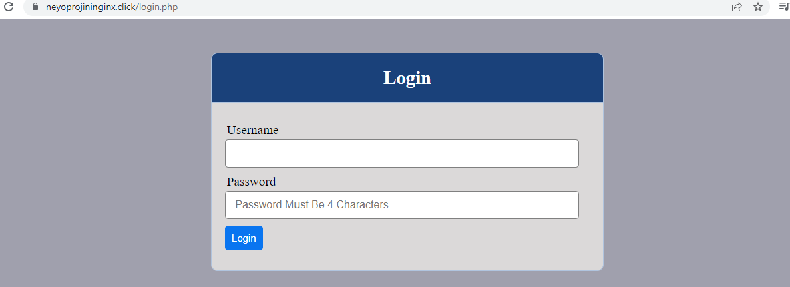

# CONFIGURE NGINX AS A LOAD BALANCER

## Create an EC2 VM based on Ubuntu Server 20.04 LTS and name it Nginx LB (do not forget to open TCP port 80 for HTTP connections, also open TCP port 443 – this port is used for secured HTTPS connections)

`sudo vi /etc/hosts`

`sudo apt update`

`sudo apt install nginx`

## Configure Nginx LB using Web Servers’ names defined in /etc/hosts

`sudo vi /etc/nginx/nginx.conf`

`upstream myproject {
    server Web1 weight=5;
    server Web2 weight=5;
  }

server {
    listen 80;
    server_name www.domain.com;
    location / {
      proxy_pass http://myproject;
    }
  }
  #comment out this line
#       include /etc/nginx/sites-enabled/*;
`

`sudo systemctl restart nginx`

`sudo systemctl status nginx`

# REGISTER A NEW DOMAIN NAME AND CONFIGURE SECURED CONNECTION USING SSL/TLS CERTIFICATES

## Register a new domain name with any registrar of your choice in any domain zone

## Assign an Elastic IP to your Nginx LB server and associate your domain name with this Elastic IP

## Update A record in your registrar to point to Nginx LB using Elastic IP address

## Install certbot and request for an SSL/TLS certificate

`sudo systemctl status snapd`

`sudo snap install --classic certbot`

`sudo ln -s /snap/bin/certbot /usr/bin/certbot`

`sudo certbot --nginx`

`crontab -e`

`* */12 * * *   root /usr/bin/certbot renew > /dev/null 2>&1`